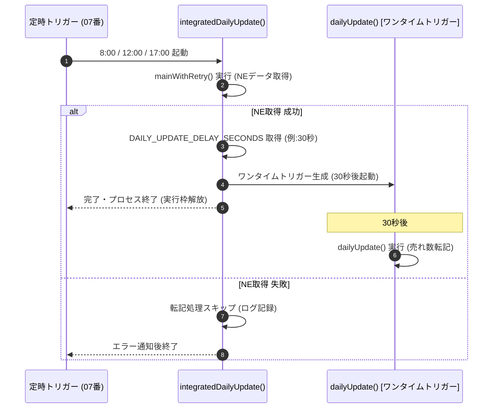

# GetSalesSummaryAcquisition (商品別・日次売れ数集計自動化プロジェクト)

## 概要
ネクストエンジンの販売データから、商品コードごとの日次販売数量を自動集計・抽出します。

## 開発背景と目的
ネクストエンジンの標準機能では「商品コード単位での日次販売実績」を直接ダウンロードすることが難しく、従来は毎日3回、手動でCSVをダウンロードして集計作業を行っていました。本プロジェクトは、この煩雑な定型業務を完全に自動化するために立ち上げられました。

## 主な機能・特徴
- **高度な集計ロジックの実装**: APIで取得した生の販売情報を解析し、商品コード×日付単位で数量を算出するロジックを構築。
- **24時間365日の稼働**: GASのトリガー設定により、深夜や年末年始など、手動では対応不可能だったタイミングでの自動集計を実現。
- **トリガーチェーン方式による非同期連携**: NEデータ取得完了後、売れ数転記スクリプト起動用のワンタイムトリガーを動的作成。GASの6分実行制限を回避しながら完全自動連携を実現。
- **業務負荷の劇的削減**: 1日3回のリピート作業を排除し、常に最新の販売動向が可視化される状態を目指しています。

## システム構成 (5フェーズ構造)
メンテナンス性と拡張性を考慮し、処理を以下の5つのフェーズに分割して構成しています。

1.  **Phase 1: 基盤構築**
    - 環境変数（スクリプトプロパティ）の管理、APIリクエスト用の日付計算、ログ出力制御。
2.  **Phase 2: 店舗マスタ連携**
    - 外部スプレッドシートとの接続、Mapオブジェクトによる高速な店舗名変換、メモリキャッシュ機構。
3.  **Phase 3: ネクストエンジンAPI接続**
    - トークンの自動更新、1,000件を超えるデータのページネーション取得、キャンセル明細のフィルタリング。
4.  **Phase 4: データ整形・書き込み**
    - APIデータ（オブジェクト）からスプレッドシート（2次元配列）への構造変換、一括書き込み（Batch Write）。
5.  **Phase 5: メイン処理とエラーハンドリング**
    - 全体のパイプライン制御、指数バックオフによるリトライ処理、実行統計レポート、メール通知、トリガーチェーン制御。

## ファイル構成

| ファイル名 | 役割 | Git管理 |
| :--- | :--- | :---: |
| `0_認証ライブラリ使用必須関数.gs` | NE認証ライブラリ使用の必須関数(変更禁止) | ○ |
| `01_基盤構築.gs` | Script Properties管理、日付計算、ログ出力制御 | ○ |
| `02_店舗マスタ連携.gs` | 店舗マスタスプレッドシート連携、メモリキャッシュ | ○ |
| `03_ネクストエンジンAPI接続.gs` | トークン自動更新、ページネーション取得 | ○ |
| `04_データ整形・書き込み.gs` | データ変換、バッチ書き込み | ○ |
| `05_メイン処理とエラーハンドリング.gs` | パイプライン制御、リトライ、通知 | ○ |
| `06_売れ数転記_改修.gs` | 売れ数転記の設定(スプレッドシートキーを含む) | ✕ |
| `07_トリガー作成スクリプト.gs` | トリガー作成 | ○ |
| `08_売れ数転記_実行処理.gs` | 売れ数転記の実行処理ロジック | ○ |

`06_売れ数転記_改修.gs` のみ、`MAKER_CONFIGS` などにスプレッドシートIDを直接記述しているためGit管理対象外(`.gitignore`)としています。それ以外のファイルは、設定値をすべてScript Propertiesで管理しているためGit管理対象です。

## 処理フロー (トリガーチェーン構造)

## 技術的な特徴

### 1. データ構造の変換 (Object to 2D Array)
モダンなAPIプログラミングと、スプレッドシート（または伝統的なBASIC言語のメモリ管理）の架け橋となる変換処理を実装しています。
- **APIレスポンス (Object):** 「ラベル（名前）」でデータを管理。データの順序は不問。
- **スプレッドシート (2D Array):** 「場所（インデックス）」でデータを管理。A列は0番目、B列は1番目という厳密な順序が必要。
この「名前ベース」から「位置ベース」へのパッキング処理を `convertToSpreadsheetRow` 関数で行うことで、高速な一括書き込みを実現しています。

### 2. 堅牢なエラーハンドリング
ネットワークの不安定さやAPI制限に対応するため、以下の機能を備えています。
- **自動リトライ:** 失敗時に待機時間を徐々に増やしながら再試行（指数バックオフ）。
- **トークン自動更新:** アクセストークンの期限切れを検知し、自動的にリフレッシュして処理を継続。
- **異常検知通知:** 致命的なエラー発生時、管理者にスタックトレースやデバッグ用リンクを含むアラートメールを送信。

### 3. パフォーマンス最適化
- **一括処理:** セルへの個別書き込みを避け、`setValues()` による一括反映を採用。
- **メモリキャッシュ:** スプレッドシートへのアクセス（IO）を減らすため、店舗マスタをメモリ上に一時保存。
- **トリガーチェーンによる非同期枠実行:** `Utilities.sleep()` による長時間の待機を排除し、後続処理を別実行枠のワンタイムトリガーとして予約。

## セットアップ方法

### 1. スクリプトプロパティの設定
Google Apps Scriptの「プロジェクトの設定」にて、以下のプロパティを設定してください。

| プロパティ名 | 説明 | 必須 |
| :--- | :--- | :---: |
| `ACCESS_TOKEN` | ネクストエンジンAPIのアクセストークン | ○ |
| `REFRESH_TOKEN` | ネクストエンジンAPIのリフレッシュトークン | ○ |
| `TARGET_SPREADSHEET_ID` | 書き込み先スプレッドシートのID | ○ |
| `TARGET_SHEET_NAME` | 書き込み先シート名 | ○ |
| `SHOP_MASTER_SPREADSHEET_ID` | 店舗マスタスプレッドシートのID | ○ |
| `SHOP_MASTER_SHEET_NAME` | 店舗マスタシート名 | ○ |
| `TRIGGER_FUNCTION_NAME` | 自動実行するメイン関数名（推奨: `integratedDailyUpdate`） | ○ |
| `TRIGGER_MODE` | トリガー設定モード（`TODAY` または `TOMORROW`） | ○ |
| `DAILY_UPDATE_DELAY_SECONDS` | `dailyUpdate()` 起動までの遅延秒数（推奨: `30`） | ○ |
| `LOG_LEVEL` | 1:全件, 2:サンプル, 3:なし | - |
| `NOTIFICATION_EMAIL` | 通知先メールアドレス | - |
| `RETRY_COUNT` | 失敗時の最大リトライ回数 | - |

### 2. 依存ライブラリ
- **NEAuth (v5):** ネクストエンジン認証用ライブラリを導入してください。

## 運用・メンテナンス

### 定期実行（トリガー設定）
1. `07_トリガー作成スクリプト.gs` の `setTrigger()` を実行すると、指定した時刻（8:00 / 12:00 / 17:00）に `TRIGGER_FUNCTION_NAME`（`integratedDailyUpdate`）が起動するトリガーが一括設定されます。
2. `integratedDailyUpdate()` は、`mainWithRetry()` 完了後に `DAILY_UPDATE_DELAY_SECONDS` 秒後に起動する `dailyUpdate()` のワンタイムトリガーを動的に作成して終了します。両処理は別の実行枠で動くため、GASの6分実行制限を受けることなく安定して運用できます。

### 手動実行
- NE取得のみ実行する場合: `mainWithRetry()` を実行してください。
- 統合処理テストを行う場合: `integratedDailyUpdate()` を実行してください。

### ログの確認
- `LOG_LEVEL` を `1` (ALL) に設定すると、APIの生レスポンスを含む詳細なステップが確認できます。
- 本番運用では `3` (NONE) または `2` (SAMPLE) を推奨します。

## 実務上のメリット
本スクリプトの導入により、これまで手動で行っていた「CSVダウンロード」「フィルタリング」「コピペ集計」の作業が完全に無人化されます。リトライ機構、トリガーチェーンによる非同期自動連携、通知機能により、管理者は「エラーメールが届かない限り、データは常に最新である」という安心感を持って、販売戦略の立案に集中できます。